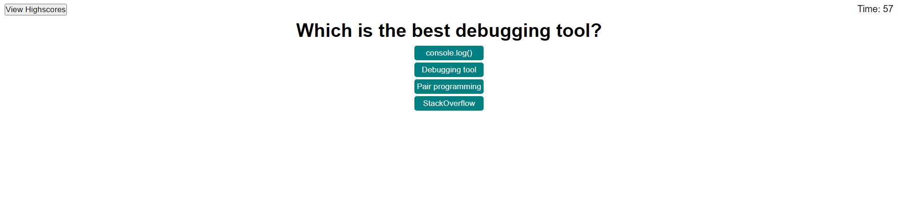

# Module 4 Challenge

## Description

This challenge was to create an application that quizzes the user on Javascript fundamentals. This application was built using HTML, CSS, and JavaScript to practices the skills we learned in class, and simulating a coding assessment that one might be given for an interview.

## Installation

N/A

## Usage

To use this webpage, you may open the page using the Github pages link or this [link](https://tkmarsten.github.io/module-3-challenge/).

## Credits

Tiarnan Marsten

## License

Please refer to the LICENSE in the repo.
